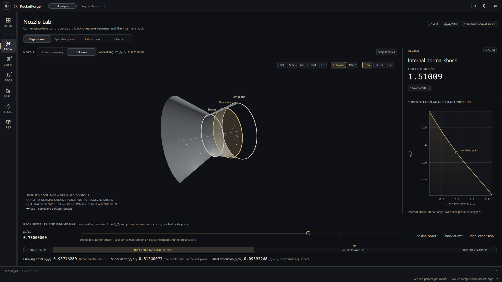
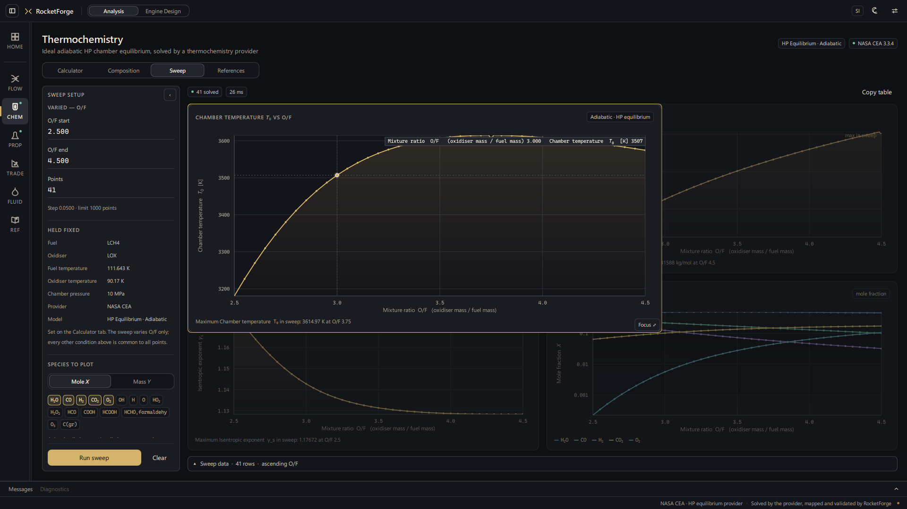

# RocketForge

[](https://github.com/halici21/rocketforge/actions/workflows/tests.yml)
[](LICENSE)
[](https://github.com/halici21/rocketforge/releases/latest)

A native desktop workstation for compressible-flow and liquid-rocket propulsion
analysis. It covers classic gas dynamics, converging–diverging nozzle
operation, NASA CEA chamber thermochemistry, ideal rocket performance and
design-space trade studies in one Qt Quick interface. Every number on screen
comes from a verified physics layer, and the views only ever read solved
state.


*Rocket Performance for LOX/LCH₄ at 100 bar, expanded to Aₑ/Aₜ 40 in vacuum:
Isp 348.658 s from a NASA CEA chamber and the ideal rocket model. The 3D view
is built from the solved area ratio and says so: schematic geometry, area
expansion only, not a solved contour.*

## What RocketForge does

- **Compressible flow.** Isentropic flow, mass flow, normal and oblique shocks,
  Prandtl–Meyer, Fanno and Rayleigh flow. Each module opens on its relation,
  with a calculator and a generated table beside it.
- **Nozzle Lab.** Back-pressure regimes of a converging–diverging nozzle, from
  unchoked through internal normal shock to over- and underexpanded. It shows
  the solved station distribution across the shock and the shock station
  against back pressure.
- **Thermochemistry.** HP chamber equilibrium from NASA CEA 3.3.4, for
  bipropellant and solid formulations. Mixture-ratio sweeps show temperature,
  molar mass, isentropic exponent and species.
- **Rocket Performance.** The ideal rocket model from a solved chamber: c\*, Cf
  with its signed pressure term, c_eff and Isp. It is drawn from the solved
  area ratio in 2D or 3D.
- **Trade Study.** Design variables, hard constraints and objectives, evaluated
  over a sampled grid. Pareto membership is decided on every objective, not
  only the two plotted. It evaluates a sample and is not an optimiser.
- **Fluids and Feed.** Fluid properties from CoolProp, and pressure drop in a
  straight line with the Darcy friction factor stated as such.
- **Engine Design.** A topology editor for engine component networks with
  typed ports and structural checks. No physics is wired into it yet (see
  [Known limitations](#known-limitations)).

| | |
| --- | --- |
|  **Nozzle Lab.** An internal normal shock at A/Aₜ = 1.51009 for p_b/p₀ = 0.70, beside the shock station against back pressure. The shock is a quasi-1D station, not a resolved shock, and the flow cues show direction only. |  **Thermochemistry sweep, hover peek.** A 41-point NASA CEA sweep. Hovering a plot enlarges it in place with its live readout, and one click opens it full size. |
|  **Isentropic Flow.** Every classic module opens on its relation. The solved state at M = 2 is marked on the generated curve, and the calculator and the reference-checked table are one tab away. |  **Trade Study.** 328 evaluated designs over O/F and Aₑ/Aₜ. For this capture, a second real objective, minimising chamber temperature, was added to the default maximise-Isp study, which gives a Pareto front. Every marker is an evaluated design, and the front is a sample of the grid. |

## Interactive engineering analysis

The views work on results that already exist; they never re-solve. A plot, its
table and the Inspector share one selection per workspace, so picking a point,
a row or a station shows the same solved sample everywhere. The tools are:

- plots that zoom, pan, probe and lens;
- a hover peek that enlarges a small multiple in place, with Focus one click
  further;
- table lenses and range selection;
- pinned table snapshots that compare two blocks side by side;
- 2D/3D engineering views that take their stations from the solved state.

Motion has Full, Reduced and Off settings, and the hover preview can be turned
off.


*A table lens across the shock in Nozzle Lab's station distribution. The
pre-shock and post-shock states share one axial position and stay two rows,
because the jump between them is the result.*

## Scientific foundations

- **Layered, frozen physics.** The layers are `core → physics → engineering →
  engine → providers → application`. Qt lives only in `application`, and NASA
  CEA and CoolProp only in `providers`. `tests/test_architecture.py` enforces
  those boundaries.
- **Verified thermochemistry.** NASA CEA is the runtime provider. Cantera is a
  development-only independent oracle, and both are checked against published
  references
  ([CEA / Cantera verification](docs/engineering/verification/CEA_CANTERA_VERIFICATION_R1.md)).
- **Reference checks in the product.** The isentropic, normal-shock and
  Prandtl–Meyer calculators compare their solved state with Anderson's
  published tables (Appendices A–C). When a state has no exact tabulated row,
  they say so instead of interpolating one.
- **Zero-view-solve.** Selecting, zooming, lensing, peeking, playing back cached
  shock samples and switching 2D/3D issue no solver calls. This is audited
  with instrumented solver entry points and live positive controls.
- **Source/package parity.** `--selftest-science` writes a bit-exact digest of
  every published value. A packaged build must match its source commit float
  for float.
- **Honest drawings.** Schematics are labelled for what they are. RocketForge's
  solvers are 0-D/1-D, so it draws no CFD, no flame and no fabricated contour.

### Verification and freeze status

| Area | Status |
| --- | --- |
| Classic gas dynamics (Fanno, Rayleigh, isentropic, normal/oblique shock, Prandtl–Meyer, mass flow) | Frozen, `rocketforge.physics.compressible` |
| Thermochemistry (NASA CEA primary provider, Cantera dev-only independent oracle) | **Verified.** CEA and Cantera are both confirmed against external published references, and cross-provider consistency holds within an evidenced envelope. See `docs/engineering/verification/CEA_CANTERA_VERIFICATION_R1.md` |
| Fluid properties | Frozen, `rocketforge.physics.fluids` |
| Line / transport (pressure drop, friction) | Frozen v1.0, `rocketforge.engineering.line` |
| Chamber + nozzle performance (c\*, Cf, Isp) | Frozen v1.0. Scalar only: no geometry, contour or dimensions |

### Known limitations

- **Engine Design mode is presentation-only.** Its topology editing is real,
  but none of its 16 component types is solved. Nothing is propagated along a
  connection, and every quantitative readout is an em-dash placeholder.
- **Performance is the ideal-rocket model**, with no efficiency factors and no
  nozzle contour design.
- **No unit conversion.** The unit indicator is fixed to SI.
- **Charts, Compare and Gas Properties** are planned modules that are not built
  yet.
- **Verified on Windows 11**, where the 3D view needs Qt Quick 3D and a 3D-capable
  renderer. Without them the 2D view stays and says why.

The full list is in [docs/REFERENCE.md](docs/REFERENCE.md#known-limitations).


*The light theme is a complete palette of its own, not a filter over the dark
one.*

## Install, run, test

**Windows build.** Download it from
[Releases](https://github.com/halici21/rocketforge/releases/latest). It is
self-contained and needs no Python. A release is a tagged version, and
`master` may be ahead of it. Every package names the commit it was built from:
see Settings → **Copy build info**.

**From source** (Python 3.13, PySide6 6.10.2):

```bash
python -m venv .venv
.venv\Scripts\activate
pip install -r requirements.txt
python main.py
```

`requirements.txt` covers the shell and the compressible-flow modules. Three
optional, additive profiles unlock the rest:

- `requirements-thermochemistry.txt` installs NASA CEA, for Thermochemistry,
  Rocket Performance and Trade Study. Cantera is deliberately not a runtime
  dependency.
- `requirements-fluids.txt` installs CoolProp, for Fluid Properties and Line.
- `requirements-3d.txt` installs PySide6-Addons, for the Qt Quick 3D views.

`run.bat` starts the source tree with the project environment, and its window
title says `[DEV <commit>]`.

> **conda / miniforge users:** use a plain virtual environment. A conda `icu`
> on the DLL search path breaks `import PySide6.QtCore`.

### Testing

```bash
.venv\Scripts\python.exe -m pytest -q
.venv-cea\Scripts\python.exe -m pytest -q
```

The first command runs the base suite. The second adds the NASA CEA provider
tests, from an environment with the thermochemistry and fluids profiles. Call
the venv's own interpreter, never a bare `python` or `pytest`: on machines with
conda installed, the bare command can resolve to the wrong interpreter.

CI runs three jobs on every push:

- the base suite;
- the production profile (NASA CEA + CoolProp);
- the base suite at the declared minimum versions.

Tests that read developer-machine evidence (the untracked `acceptance/`
folder) skip themselves, with the reason, when it is absent.

### Building the Windows executable

```bat
build_exe.bat
```

This is the one build command, and `dist\RocketForge\RocketForge.exe` is the
one package.

- **Preconditions:** it refuses a dirty or unpushed tree and any unpinned
  PySide6, NASA CEA, CoolProp or PySide6-Addons.
- **Identity:** it stamps the commit into the package.
- **Verification:** it verifies the result by running the package itself.

Build identity, launch paths and verification are covered in
[docs/engineering/release/BUILD_AND_LAUNCH.md](docs/engineering/release/BUILD_AND_LAUNCH.md).

### Documentation

- [docs/README.md](docs/README.md): the index of specs, implementation phases
  and verification campaigns.
- [docs/REFERENCE.md](docs/REFERENCE.md): keyboard shortcuts, project
  structure, the Engine Design architecture, the design system, the component
  inventory and the full limitations list.
- [docs/engineering/INTERACTIVE_VISUALIZATION_CONTRACT.md](docs/engineering/INTERACTIVE_VISUALIZATION_CONTRACT.md):
  what the interactive views may and may not do.
- [CONTRIBUTING.md](CONTRIBUTING.md) and [CHANGELOG.md](CHANGELOG.md).

## License

[MIT](LICENSE).
