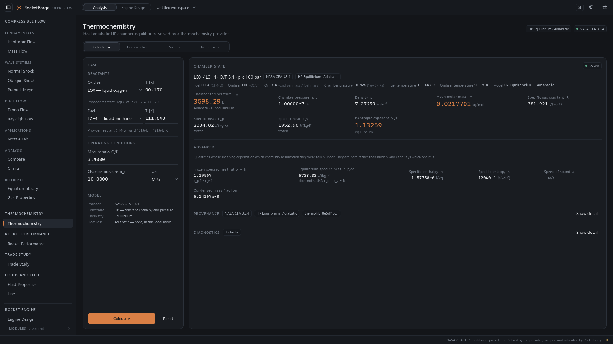
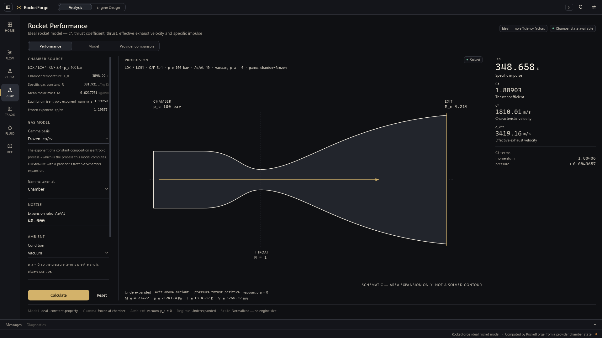
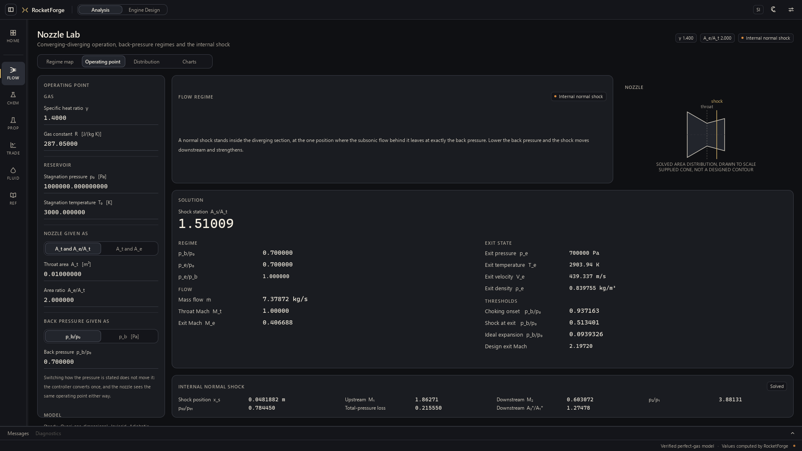
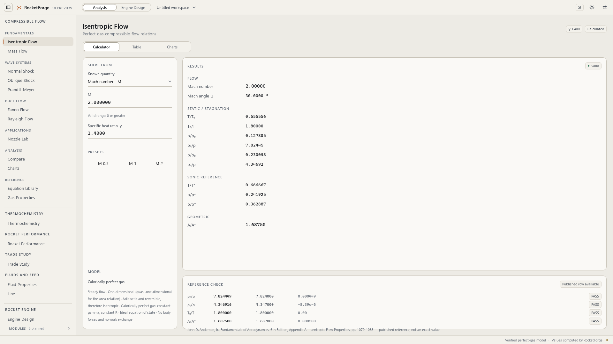
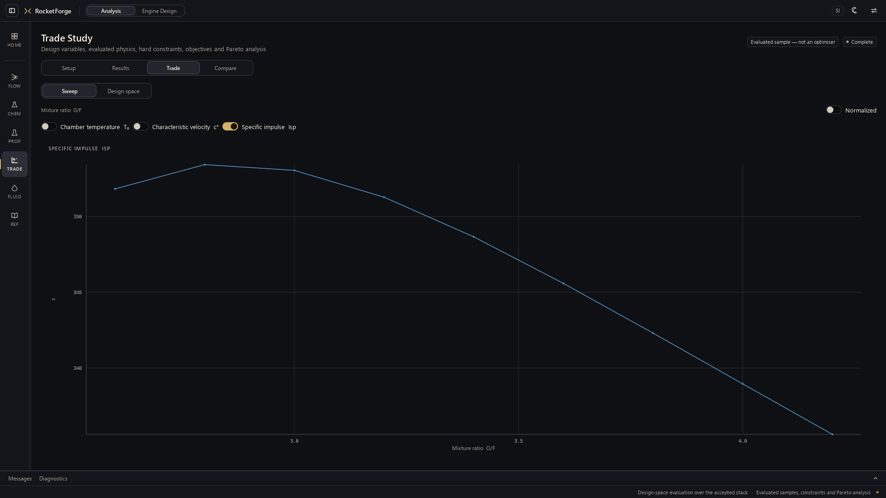
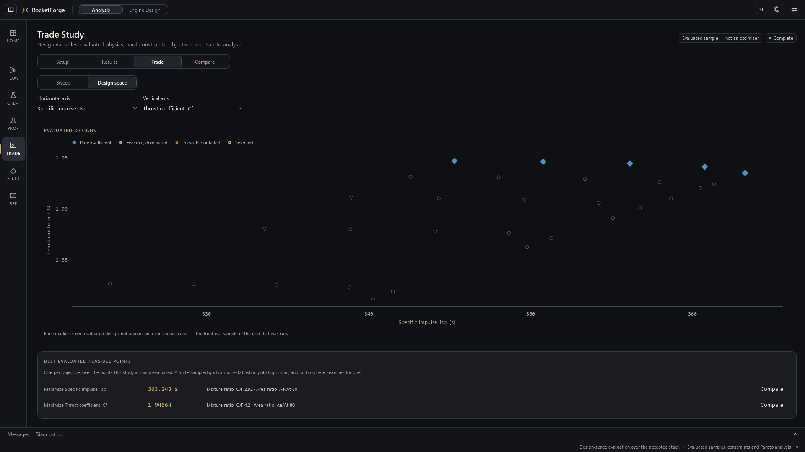
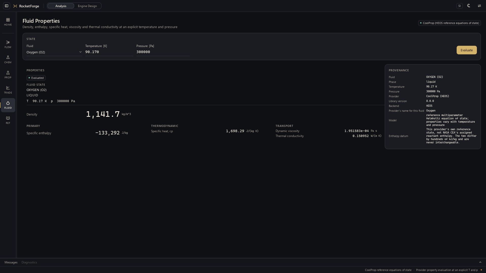
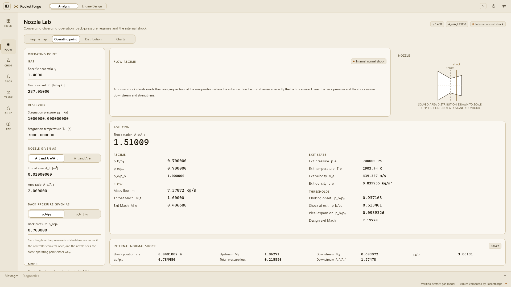
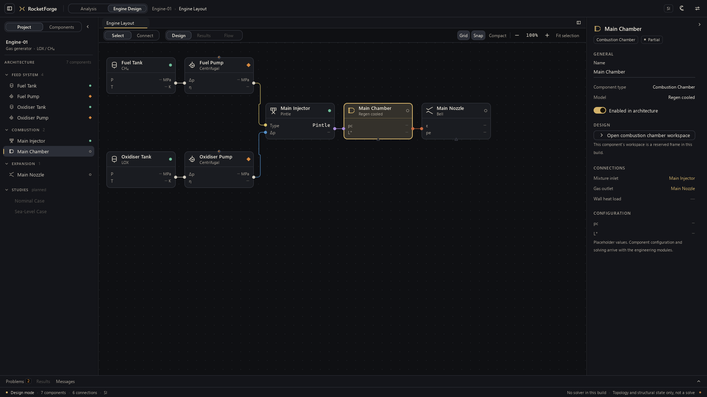

# RocketForge — desktop workstation for compressible-flow and propulsion analysis

[](https://github.com/halici21/rocketforge/actions/workflows/tests.yml)
[](LICENSE)
[](https://github.com/halici21/rocketforge/releases/latest)

**[Download the most recent release's Windows build](https://github.com/halici21/rocketforge/releases/latest)**
— self-contained, no Python install required. A release is a tagged version;
`master` may be ahead of it, and a package made by `build_exe.bat` says which
commit it is
([which build?](docs/engineering/release/BUILD_AND_LAUNCH.md)). See
[Known limitations](#known-limitations) before you do: Analysis mode is real
physics, Engine Design mode is a real topology editor with no physics wired
into it yet.


*Oblique Shock, Study mode — the θ–β–M relation at M₁ = 2.00 with the solved
operating point marked on the weak branch. Every curve here comes from the
same solver that produces the numbers on the Calculator tab.*

A native desktop workstation for compressible-flow analysis and liquid rocket
engine preliminary design, built around one shell: a narrow family rail
(Compressible Flow, Thermochemistry, Rocket Performance, Trade Study, Fluids
and Feed, Reference) that opens a module directly or, for a family with
several, a contextual drawer scoped to that family alone; a context-sensitive
Inspector drawer; a collapsible Analysis Dock; and two working modes:

* **Analysis** - one workspace per compressible-flow / propulsion module,
  backed by a real, frozen physics stack: classic gas dynamics (Fanno,
  Rayleigh, isentropic, normal/oblique shock, Prandtl-Meyer, mass flow), NASA
  CEA / Cantera-verified thermochemistry, fluid properties, line/transport, a
  chamber+nozzle performance chain (c*, Cf, Isp), and a Trade Study workspace
  (parametric sweep as the primary view, with a generic-axis design-space/
  Pareto projection alongside it) over already-solved points. Every result on
  these pages comes from `rocketforge/physics/` and `rocketforge/engineering/`
  through a provider adapter — nothing is a hand-authored constant. See
  [Verification campaigns](#verification-and-freeze-status) for the evidence.
* **Engine Design** - a canvas where an engine is built as a network of
  physical components joined through typed ports. The topology-editing layer
  is real: add, move, connect, rename, duplicate and delete components, real
  port-direction/type compatibility validation, and structural-problem
  detection (missing required connections, duplicate names, orphaned
  components). **No component in this mode is solved**: nothing is
  propagated along a connection, and every quantitative readout is an
  explicit em-dash placeholder rather than a fabricated number. See
  [Known limitations](#known-limitations).

Python + PySide6 + Qt 6, with the entire interface written in QML / Qt Quick.
Python does nothing but start Qt and load `ui/Main.qml`.

## Screenshots

Captured headlessly from the real, running application, with real solves — not
mockups and not mock data. The chemistry-backed screens require the production
profile (NASA CEA installed); the rest run on the frozen perfect-gas stack.

### Analysis

| | |
| --- | --- |
|  **Thermochemistry** — a real NASA CEA 3.3.4 chamber equilibrium, with the equilibrium-state schematic labelled for what it is and provenance shown beside the result. |  **Rocket Performance** — the chamber state expanded through a nozzle to Isp / Cf / c\* / c_eff, over a schematic drawn from the solved area ratio and nothing else. |
|  **Nozzle Lab** — converging–diverging operation with an internal normal shock. The nozzle is drawn to scale from the solved area distribution, with the throat and the shock at their own solved stations. |  **Isentropic Flow** — every classic gas-dynamics module opens on its relation, not on a form. The calculator and the reference-checked table are a click away. |
|  **Trade Study, sweep** — the response of one metric as a single design variable is swept, over points the study actually evaluated. |  **Trade Study, design space** — a projection of the evaluated space. Pareto membership is decided using every objective the study defines, not just the two plotted. |
|  **Fluid Properties** — a single state from a reference equation of state, with the provider, its version and its enthalpy datum stated rather than assumed. |  **Light theme** — the same workspace. Both themes are first-class; neither is a filter applied to the other. |

### System design



**Engine Design** — a seven-component LOX/CH₄ gas-generator topology with the
Main Chamber selected and its inspector open. This is the mode this README is
explicit about ([Known limitations](#known-limitations)): the topology editing
is real, and **no component is solved**. Every quantitative readout is an
em-dash placeholder, the inspector says so in words, and the status bar reads
"No solver in this build · Topology and structural state only, not a solve".

---

## Running

```bash
python -m venv .venv
.venv\Scripts\activate
pip install -r requirements.txt
python main.py
```

Verified on Windows 11 with Python 3.13 and PySide6 6.10.2.

`requirements.txt` covers the UI shell and the classic compressible-flow
pages. Three more, all optional and additive, unlock more of Analysis mode:

* `requirements-thermochemistry.txt` — installs NASA CEA (`cea`), enabling the
  Thermochemistry and Rocket Performance pages. Without it those pages
  degrade gracefully and say why. Cantera is deliberately **not** in any
  requirements file — it is a dev-only, independently-run verification oracle
  (see [Verification and freeze status](#verification-and-freeze-status)),
  never a runtime dependency.
* `requirements-fluids.txt` — installs CoolProp, enabling Fluid Properties and
  Line.
* `requirements-3d.txt` — installs PySide6-Addons for Qt Quick 3D, enabling the
  3D view in Rocket Performance. Without it (or on a software renderer) the
  2D schematic stays the view and the 3D choice says why.

`requirements-dev.txt` adds the test/tooling dependencies for running the
suite in [Testing](#testing) below.

`run.bat` is the development launcher: it runs `main.py` from this tree with
the project environment (`.venv-cea`, else `.venv`; never a `python` from
`PATH`), and the window title says `[DEV <commit>]`. It never starts a
packaged build. Which build is running is always one click away: Settings
(the gear) shows the build and **Copy build info** — see
[docs/engineering/release/BUILD_AND_LAUNCH.md](docs/engineering/release/BUILD_AND_LAUNCH.md).

### Testing

```bash
.venv\Scripts\python.exe -m pytest -q
```

Runs the full suite against the base environment (UI shell + classic
compressible-flow physics). To also exercise the CEA-backed Thermochemistry
and Rocket Performance provider tests, create a second environment with
`requirements-thermochemistry.txt` installed and run pytest through that
interpreter instead — e.g. `.venv-cea\Scripts\python.exe -m pytest -q`.

Always invoke the venv's own `python.exe`/`pytest` directly rather than a
bare `python`/`pytest` on `PATH` — on a machine with conda/miniforge also
installed, the bare command can silently resolve to the wrong interpreter.

CI (see the badge above) runs three jobs on every push: the base suite, the
production profile (NASA CEA and CoolProp), and the base suite at the
declared minimum versions. Nothing is excluded by file. The few tests that
read measurements recorded on a developer machine (the untracked
`acceptance/` folder) skip themselves one by one, with the reason, when that
evidence is absent.

### Building the Windows executable

Prebuilt: see [Releases](https://github.com/halici21/rocketforge/releases).
Each release names the commit it was built from.
To build it yourself, with `.venv-cea` holding `requirements.txt`,
`requirements-thermochemistry.txt`, `requirements-fluids.txt` and
`requirements-3d.txt`:

```bat
build_exe.bat
```

The one build command. It produces the one canonical package:

```
dist\RocketForge\RocketForge.exe
dist\RocketForge\rocketforge_build.json   the build's identity: commit, channel, versions
dist\RocketForge\BUILD.md                 the build record: SHA-256, size, checks
```

It refuses a dirty or unpushed tree, and any PySide6, NASA CEA or CoolProp
other than the pinned versions. It regenerates the icon, packages from
`packaging/RocketForge.spec`, and verifies the result by running the package
itself: identity, bundled provider, the Nozzle Lab → Thermochemistry route,
and a science self-test. A package that fails its checks is marked as an
unknown build. `build_exe.bat --development` packages any tree, labelled
development.

To check a package later, run
`.venv-cea\Scripts\python.exe packaging\verify_package.py --smoke`. The
package's commit must equal HEAD, or it is reported stale. Copy the whole
`dist\RocketForge` folder to run it on a machine with no Python. The full
definition of source, packaged, stale and unknown builds, and of every launch
path, is in
[docs/engineering/release/BUILD_AND_LAUNCH.md](docs/engineering/release/BUILD_AND_LAUNCH.md).

PyInstaller rather than `pyside6-deploy`, because the official tool wraps
Nuitka and needs a C toolchain on the build machine. A directory build rather
than `--onefile`, because one-file unpacks the entire Qt runtime to a temporary
folder on every launch, which is both slow to start and a poor fit for QML -
imports resolve against real paths. `ui/` travels as data and stays readable
inside the bundle; `main.py` finds it through `sys._MEIPASS`, so nothing
depends on the working directory.

> **Note for conda / miniforge users.** Qt6Core links the system ICU. A conda
> environment that has the `icu` package on its DLL search path shadows it with
> a build that exports versioned symbols only, and PySide6 then fails to import
> with `DLL load failed while importing QtCore`. Use a plain virtual
> environment (as above) rather than a conda base environment.

### Keyboard

Application-wide:

| Shortcut       | Action                             |
| -------------- | ---------------------------------- |
| `Ctrl+E`       | Switch between Analysis and Engine Design |
| `Ctrl+B`       | Show / hide the navigator          |
| `Ctrl+Shift+T` | Cycle light / dark / system        |
| `↑` `↓`        | Move through modules (nav focused) |
| `Tab`          | Move focus through controls        |

Engine Design:

| Shortcut          | Action                                   |
| ----------------- | ---------------------------------------- |
| `Ctrl+K`          | Command palette                          |
| `Ctrl+Shift+F`    | Focus the workspace (fold both side panels) |
| `Ctrl+0`          | Fit the architecture to the view         |
| `F`               | Frame the selection, or the engine when nothing is selected |
| `Ctrl+A`          | Select all components                    |
| `Ctrl+D`          | Duplicate the selection                  |
| `Delete`          | Delete the selection                     |
| `Escape`          | Cancel a pending connection / deselect   |
| Wheel             | Zoom about the cursor                    |
| Middle-drag, `Space`-drag | Pan                              |
| Shift-click, drag on empty canvas | Extend / marquee selection |

---

## Project structure

```
rocket/
├── main.py                     application bootstrap (Qt start, App singleton, QML load)
├── requirements.txt
└── ui/
    ├── Main.qml                window, mode switching, theme and page state
    ├── theme/                  design tokens (QML singletons)
    │   ├── qmldir
    │   ├── Theme.qml           colour tokens, light and dark palettes
    │   ├── Typography.qml      families, sizes, weights, tracking
    │   ├── Metrics.qml         spacing scale, radii, shell dimensions
    │   └── Motion.qml          durations and easing curves
    ├── components/             the RF* control library (27 components)
    ├── shell/                  TopBar, SideNav, WorkspaceHost, StatusBar, SettingsPanel
    ├── pages/                  analysis modules + the shared placeholder skeleton
    ├── visuals/                NozzleVisualization, MockScientificPlot, MockLineSeries
    ├── data/                   Navigation (information architecture) and MockData
    │   └── qmldir
    └── engine/                 the Engine Design mode
        ├── EngineWorkspace.qml     mode shell: sidebar | documents | inspector | panel
        ├── CollapsiblePanel.qml    a SplitView child that folds away and returns
        ├── PanelRail.qml           the strip a folded panel leaves behind
        ├── EngineSidebar.qml       Project / Components switch
        ├── EngineProjectPanel.qml  project tree, grouped by subsystem
        ├── ComponentPalette.qml    catalogue, search, port-type legend
        ├── ComponentPaletteItem.qml  one palette row and the drag it starts
        ├── EngineCanvas.qml        pan, zoom, grid, marquee, drops, pending connection
        ├── EngineNode.qml          one component, driven entirely by registry data
        ├── EnginePort.qml          one typed port
        ├── EngineConnection.qml    one routed line
        ├── Routing.js              orthogonal routing and rounded-path geometry
        ├── EngineToolbar.qml       pointer tool, canvas view, view controls
        ├── EngineInspector.qml     context panel router
        ├── WorkspaceTabs.qml       open-document bar
        ├── BottomPanel.qml         Problems / Results / Messages
        ├── ProblemsPanel.qml       structural checks, click to locate
        ├── CommandPalette.qml      Ctrl+K
        ├── model/
        │   ├── qmldir
        │   ├── ComponentRegistry.qml   component catalogue and node/port geometry
        │   ├── EngineModel.qml         the editor-level graph
        │   └── MockEngineData.qml      every fixed value the mode displays
        ├── inspector/              reusable sections and the inspector states:
        │                           InspectorHeader, InspectorStatusSection,
        │                           InspectorConnectionsSection,
        │                           InspectorEngineContextSection,
        │                           InspectorNavigationSection, InspectorSection,
        │                           InspectorRow, NodeInspector,
        │                           ComponentContextInspector, ConnectionInspector,
        │                           EngineOverviewInspector
        ├── visuals/                ComponentGlyph, PortShape, InjectorSchematic,
        │                           NozzleSchematic, CycleSchematic
        ├── workspaces/             ComponentWorkspaceFrame, ConfigField,
        │                           EngineLayoutDocument, Injector/Nozzle/Placeholder
        └── dialogs/                NewEngineDialog
```

```
├── build_exe.bat               the canonical Windows build
├── run.bat                     development launcher (source only)
└── packaging/
    ├── build_release.py        the build: preconditions, identity, package, verify
    ├── verify_package.py       is dist\RocketForge the build of this commit?
    ├── RocketForge.spec        PyInstaller build description
    ├── make_brand_icon.py      the product mark; --icons-only writes the .ico files
    └── RocketForge.ico         generated by the build; not in version control
```

Analysis pages call into `rocketforge/application/analysis/` controllers,
which are thin Qt adapters over the real, frozen physics in
`rocketforge/physics/` and `rocketforge/engineering/` — see
[Verification and freeze status](#verification-and-freeze-status).
`ui/data/MockData.qml` is now vestigial (only the unbuilt Equation Library
page still reads it). Everything the engine mode displays still comes from
`ui/engine/model/MockEngineData.qml`; replacing that mock layer with a real
backend is the next major phase, gated on wiring real component solvers into
Engine Design's own workspaces.

---

## Engine workspace architecture

**Three layers, and this build implements the first.**

```
UI graph model  ->  engineering configuration  ->  solver
   EngineModel        (partly: node meta)         (does not exist)
```

**Canvas.** `EngineCanvas` owns the view and the transient interactions - pan,
zoom, the dot grid, marquee selection, palette drops and the connection being
drawn. It owns no data. The grid is painted once per zoom level into a tile one
cell larger than the viewport and then only translated, so panning repaints
nothing.

**Node model.** `EngineModel` holds components and connections in two
`ListModel`s so that moving one component updates one row rather than rebuilding
the scene. Because QML cannot track reads inside a ListModel, two revision
counters exist: bindings that depend on positions read `geometryRevision`,
bindings that depend on graph shape read `graphRevision`.

**Component model.** `ComponentRegistry` is the extension point. A component
type is one entry - display name, category, glyph, placeholder rows and port
topology - and the palette, the canvas, the node renderer, the inspector and
the workspace router all read from it. Adding a heat exchanger is a registry
entry plus a glyph; there is no per-type node file to write. Node size and port
offsets are registry functions too, so the node item and the connection router
derive port positions from one source and cannot disagree.

**Port model.** A port is `{ id, label, type, direction, subtype, side,
required }`. Type (fluid / mechanical / thermal) decides compatibility and is
drawn as a shape - circle, diamond, square. Subtype (fuel, oxidiser, coolant,
hot gas, ...) is metadata that tints the line and names it; it never blocks a
connection. Sides encode the convention that makes a cycle readable: fluid in
on the left, out on the right, mechanical drive on top, thermal below.

**Connection model.** Connections are stored in flow direction whichever way
they were drawn, and are routed orthogonally with rounded corners by
`Routing.js`. Each leg carries its own hit rectangle, so a line is as
selectable as a node without any invisible padding on screen. A connection is a
first-class object with its own inspector - it is where mass flow, pressure and
temperature will live once a solver exists.

**Inspector model.** One panel, four states (engine overview, component,
connection, multiple selection), assembled from `InspectorSection` and
`InspectorRow`. Every selection source - canvas, project tree, problems list,
connection - writes to the same selection in `EngineModel`, so the panel never
has to know where a selection came from.

**Workspace navigation.** The mode holds a list of open documents. The engine
layout is document zero and cannot be closed; double-clicking a component opens
its workspace as another document, routed by the registry's `workspace` field
to the injector workspace, the nozzle workspace or the reserved-frame
placeholder. Documents stay instantiated once opened, which preserves canvas
pan, zoom and per-workspace state across tab switches. Tabs answer *what is
open*; the breadcrumb in the application bar answers *where am I*.

### The inspector is context-sensitive

The panel on the right is chosen from two inputs, not one: what is selected,
**and which document is open**.

| Where the user is | Selection | Inspector shows |
| ----------------- | --------- | --------------- |
| Engine Layout | nothing | the engine: architecture, contents, performance placeholders |
| Engine Layout | one component | its metadata, its connections, and the way into its workspace |
| Engine Layout | one connection | the connection and its endpoints |
| Engine Layout | several | the selection, with actions on all of it |
| Component workspace | its own component | status, the engine around it, the project, and the way back to the layout |
| Component workspace | a different component | that component, with its workspace offered |

The fifth row is the reason the second input exists. Selection alone cannot
tell "the injector is selected on the canvas" from "the injector workspace is
open", because the injector is selected in both - and in the second case an
*Open injector workspace* button opens the page it is drawn on. The sixth row
is why the rule is about context rather than a blanket suppression: reaching
over to the project tree and picking the fuel pump while the injector workspace
is open makes offering the *pump* workspace navigation, not repetition.

Sections are shared between the states (`InspectorHeader`,
`InspectorStatusSection`, `InspectorConnectionsSection`,
`InspectorEngineContextSection`, `InspectorNavigationSection`) rather than each
state re-implementing rows, and `InspectorNavigationSection` exists as its own
component so that whether navigation appears is a decision the caller has to
take rather than one buried in a condition.

### Typed ports: shape is the domain, colour is the subtype

Two levels, so the vocabulary can grow without running out of distinguishable
colours:

| Shape | Physical domain |
| ----- | --------------- |
| circle | fluid |
| diamond | mechanical / shaft |
| triangle | thermal |
| square | signal / control |

Colour then carries the subtype *within* a domain - fuel, oxidiser, coolant,
hot gas, pressurant, mixture. A new propellant is a new tint inside an existing
shape; a genuinely new physical domain is a new shape. Shape leads because it
is what survives a greyscale screenshot, a colour-blind reader and a line seen
at 40 % zoom. Drawn by `visuals/PortShape.qml`, named once in the palette
legend, and the editor still refuses to connect two different domains.

---

## Design system

### Colour

Two complete palettes live side by side in `Theme.qml` and are swapped as a
unit, so a token can never exist in one scheme and be missing from the other.
Call sites only see semantic names (`Theme.surface`, `Theme.textMuted`).

| Role | Dark | Light |
| ---- | ---- | ----- |
| window background | `#131519` | `#EFEDE8` |
| surface (panels) | `#191C21` | `#FAF9F6` |
| elevated (popups) | `#1F232A` | `#FFFFFF` |
| subtle (chrome, sunken) | `#16191E` | `#F4F2ED` |
| hover | `#232830` | `#EAE7E0` |
| text | `#E7E9EC` | `#1C1F24` |
| text secondary | `#A4ABB5` | `#565D67` |
| text muted | `#727A85` | `#7A828C` |
| text disabled | `#4E555F` | `#AEB4BC` |
| divider / border | `#232830` / `#2B313A` | `#E3E0D9` / `#D6D2CA` |
| accent (ember) | `#D97F45` | `#BE5F2B` |
| success / warning / error | `#5FAE8C` `#D9B25B` `#D9695E` | `#3E8A69` `#9E7A26` `#B44B41` |
| grid / axis | `#232830` / `#3E4650` | `#E4E1DA` / `#B9B4AB` |

Neither scheme uses pure black or pure white. The accent is a single ember hue
reserved for state — focus, current selection, the inspected operating point,
the shock station — and never used for decoration. It sits at the *end* of the
data-series ramp so a curve is never the same colour as a marker on it.

**Surface hierarchy:** window background → shell chrome (subtle) → panels
(surface) → popups (elevated). Elevation is a colour step, not a shadow. There
are no gradients in the interface; the one wash inside the nozzle drawing peaks
at 7 % alpha.

### Typography

Two families: a humanist sans for prose (Inter → Segoe UI Variable → Segoe UI
→ …) and a monospaced face for every engineering quantity (JetBrains Mono →
Cascadia Mono → Consolas → …). The mono face is what gives readouts their
column alignment and keeps γ, ρ, ṁ, subscripts and exponents on a predictable
rhythm. The family is resolved at runtime from what is installed.

| Role | Size | Face |
| ---- | ---- | ---- |
| page title | 21 semibold | sans |
| page subtitle | 12.5 | sans |
| section label | 10.5 semibold, +1.1 tracking, uppercase | sans |
| body / secondary | 13 / 12 | sans |
| input label | 11.5 | sans |
| input value | 15 medium | mono |
| readout hero / large / medium / small | 32 / 20 / 15 / 12.5 | mono |
| axis tick | 11.5 | mono |
| axis title / chart annotation | 12 / 11 | sans |
| nav item / nav group | 12.5 / 10 | sans |
| status / meta | 11 / 10.5 | sans |

A plot carries its own three sizes rather than borrowing `meta`: a tick label
sitting beside a 600px-tall scientific chart is a different reading task from
a caption inside a dense rail, and the chart scale is what keeps every plot in
the application agreeing with every other.

### Spacing, radii, motion

* Spacing scale: 2, 4, 8, 12, 16, 20, 24, 32, 40 — nothing off-scale.
* Radii: 4 small marks · 6 chips · 8 inputs, buttons, segments · 10 grouped
  controls and popups · 12 panels and workspace surfaces. No pill shapes.
* Strokes: one hairline everywhere; focus rings 1.5.
* Motion: 110 ms hover/focus · 160 ms selection and panel state · 220 ms page
  entry and shock-marker travel. `OutCubic` and `InOutCubic` only — no
  overshoot, no bounce.

### Interaction rules

* Hover lifts a surface one colour step; press goes one further.
* Focus is a 1.5 px accent ring drawn *outside* the control, so focus never
  changes layout.
* Selection is marked twice: a 2 px accent bar plus a weight change in the
  navigator, an accent rule plus a colour change on the band scale. State is
  never carried by colour alone.
* Unavailable actions stay legible — a bordered surface with muted text and a
  note saying when they arrive — rather than being hidden or faded out.
* Guides are dashed; data is solid. A reference level can never be mistaken
  for a curve.

---

## Component inventory

| Component | Role |
| --------- | ---- |
| `RFPanel` | The only surface container: title, optional trailing slot, column body |
| `RFPageHeader` | Page title, subtitle and page-level actions |
| `RFSectionLabel` | The one label style that opens a group of content |
| `RFDivider` | Hairline separator, horizontal or vertical |
| `RFDashedLine` | Dashed guide line for reference levels |
| `RFDashedFrame` | Dashed outline marking reserved space |
| `RFNumberField` | Primary engineering input: label, mono value, unit, hover steppers, focus rule |
| `RFTextField` | Prose twin of the number field |
| `RFComboBox` | Selector with the same anatomy as a field; fully restyled popup |
| `RFSegmentedControl` | Mutually exclusive choices with a sliding selection |
| `RFSlider` | Instrument-style slider: hairline track, tick scale, square handle |
| `RFToggle` | Binary switch |
| `RFButton` | Text button in primary / default / quiet weights |
| `RFIconButton` | Square quiet action button with tooltip |
| `RFIcon` | The complete icon set, drawn as strokes on a 16×16 grid |
| `RFNavItem` | Navigator row with accent marker and future-state badge |
| `RFResultValue` | One quantity: label above, mono value with baseline-aligned unit |
| `RFReadoutStrip` | Horizontal instrument readout — the alternative to KPI tiles |
| `RFStatusChip` | Small state marker, dot plus word |
| `RFBandScale` | Labelled range scale with one active band |
| `RFPlotSurface` | Scientific plot frame: axes, grid, ticks, legend, data↔pixel mapping |
| `RFEquationBlock` | A relation shown as static rich text |
| `RFEmptyState` | Message for content that does not exist yet |
| `RFMenu` / `RFMenuItem` | Popup surface and menu row |
| `RFTooltip` | Tooltip matched to the panels rather than the platform |
| `RFScrollBar` | Thin auto-fading scrollbar |

Visuals: `NozzleVisualization` (contour + axial pressure trace on one shared
axial axis, shock station crossing both), `MockScientificPlot` (ratio curves
with a cursor inspector), `MockLineSeries` (one polyline in a plot surface).

No Qt Quick Controls default styling is visible anywhere: Qt controls are used
for behaviour, and every painted part is replaced.

### Engine Design components

| Component | Role |
| --------- | ---- |
| `EngineWorkspace` | The mode shell: sidebar, documents, inspector, bottom panel |
| `EngineSidebar` | Project / Components switch |
| `EngineProjectPanel` | Project hierarchy; the component group is the live graph |
| `ComponentPalette` | Catalogue generated from the registry, with search and a port legend |
| `ComponentPaletteItem` | One palette row and the drag it starts |
| `EngineCanvas` | View, grid, marquee, drops, pending connection, context menus |
| `EngineNode` | One component - registry-driven, so there is no per-type node file |
| `EnginePort` | One typed port: shape by type, tint by subtype, mark when required |
| `EngineConnection` | One orthogonally routed line with per-leg hit areas |
| `EngineToolbar` | Pointer tool, canvas view selector, grid/snap/detail, zoom |
| `EngineInspector` | Context panel router over four states |
| `InspectorSection` / `InspectorRow` | The two pieces every inspector state is built from |
| `EngineOverviewInspector` | Engine-level state when nothing is selected |
| `NodeInspector` | Component metadata, connections and the way into its workspace |
| `ConnectionInspector` | A connection as a first-class object |
| `WorkspaceTabs` | Open-document bar |
| `BottomPanel` / `ProblemsPanel` | Problems, Results, Messages; click a problem to locate it |
| `CommandPalette` | Ctrl+K command list |
| `ComponentWorkspaceFrame` | The shared frame every detailed component workspace uses |
| `ConfigField` | Renders one configuration entry as the control its kind calls for |
| `EngineLayoutDocument` | Toolbar plus canvas, as one document |
| `InjectorWorkspace` / `NozzleWorkspace` | The two designed component workspaces |
| `PlaceholderComponentWorkspace` | Reserved frame for components without a module |
| `NewEngineDialog` | Name plus cycle template, with a schematic preview |
| `ComponentGlyph` | The schematic symbol for every component type |
| `InjectorSchematic` / `NozzleSchematic` / `CycleSchematic` | The three drawings |
| `Routing.js` | Orthogonal routing and rounded-path geometry |

**Component catalogue** (16 types, all draggable, all from the registry):
Tank · Pump · Valve · Regulator · Orifice · Injector · Combustion Chamber ·
Igniter · Nozzle · Turbine · Shaft · Gas Generator · Preburner · Cooling Jacket ·
Heat Exchanger · Film Cooling.

### Implemented interactions

Drag a component from the palette onto the canvas (with a live snapped drop
preview) or click it to place it at the centre · move one or several components
· marquee-select on empty canvas · shift-click to extend a selection · draw a
connection by dragging port to port, or click-to-click in Connect mode ·
incompatible ports dim and refuse · select a connection · rename, duplicate,
disable, disconnect and delete from the context menu · double-click a component
to open its workspace · switch and close document tabs · click a problem to
select and frame the component it refers to · select in the project tree and the
canvas follows, and the reverse · collapse the bottom panel · fold the project
panel and the inspector away and bring them back from their rails · focus the
workspace with Ctrl+Shift+F · pan, zoom, reset · fit the engine, or the
selection when there is one · reveal a connection's flow direction by hovering
it · toggle grid, snap and node density · Ctrl+K command palette · create an
engine from a cycle template.

---

## Screens

**Analysis mode — fully designed and solver-backed**

* Application shell — top bar, a narrow family rail with a contextual
  module drawer, a context-sensitive Inspector drawer, a collapsible Analysis
  Dock, status line, settings
* Home — the workbench overview: every workspace's own current state
  (solved / evaluated / not configured), in one place
* Isentropic Flow, Mass Flow, Normal Shock, Oblique Shock, Prandtl–Meyer,
  Fanno Flow, Rayleigh Flow — each a thin QML/controller adapter over its own
  frozen relation in `rocketforge.physics.compressible`
* Thermochemistry — NASA CEA primary provider, Cantera dev-only independent
  oracle, both verified (see
  [Verification and freeze status](#verification-and-freeze-status))
* Fluid Properties — `rocketforge.physics.fluids`
* Line — pressure-drop / friction transport, `rocketforge.engineering.line`
* Rocket Performance — chamber + nozzle scalar performance chain (c*, Cf, Isp)
* Trade Study — a parametric sweep (the primary grammar: response curves
  against the swept variable) or, once two or more variables are varied, a
  generic-axis design-space/Pareto projection — both views over
  already-solved points; the workspace itself runs no new solves beyond the
  study evaluation the user explicitly requests
* Nozzle Lab — nozzle drawing, back-pressure control, operating-band scale
* Equation Library — reference relations as static rich text

**Analysis mode — placeholders** (real page frame and header, reserved anatomy,
no backend)

Compare · Charts · Gas Properties

**Engine Design mode — a real topology editor, zero component physics**

* Engine workspace — project panel (subsystem-grouped tree), canvas,
  inspector, bottom panel, document tabs, both side panels collapsible to a
  rail
* Component palette — 16 component types with schematic glyphs
* Engine layout canvas — real pan/zoom/grid/marquee-select, port-typed
  connection drawing with real compatibility validation, structural-problem
  detection; the demo gas-generator architecture loads 7 components
* Main Injector workspace — configuration, pintle section drawing, summary
* Main Nozzle workspace — geometry, contour drawing, summary
* New-engine dialog — six cycle templates with schematic previews

**Engine Design mode — placeholders**

Every other component workspace opens the reserved frame · the Results and Flow
canvas views are present and disabled · the component design modules
(Performance, Chamber, Cooling, Feed System, Engine Cycles) remain a collapsed
list of *soon* rows in the navigator.

---

## Verification and freeze status

Analysis mode is backed by a real physics stack under `rocketforge/physics/`
and `rocketforge/engineering/`, built and verified in a sequence of gated,
documented campaigns (`docs/engineering/implementation/`,
`docs/engineering/verification/`):

| Area | Status |
| --- | --- |
| Classic gas dynamics (Fanno, Rayleigh, isentropic, normal/oblique shock, Prandtl-Meyer, mass flow) | Frozen, `rocketforge.physics.compressible` |
| Thermochemistry (NASA CEA primary provider, Cantera dev-only independent oracle) | **Verified** — CEA and Cantera both confirmed correct against external published references, cross-provider consistency confirmed within an evidenced envelope; see `docs/engineering/verification/CEA_CANTERA_VERIFICATION_R1.md` |
| Fluid properties | Frozen, `rocketforge.physics.fluids` |
| Line / transport (pressure drop, friction) | Frozen v1.0, `rocketforge.engineering.line` |
| Chamber + nozzle performance (c*, Cf, Isp) | Frozen v1.0 — scalar-only: no geometry, no contour, no dimensions |

The full paper trail — specs, implementation phases, verification
campaigns, and the design tooling stack — is indexed in
**[docs/README.md](docs/README.md)**.

**Engine Design mode remains presentation-only.** A component-by-component
audit against the live registry (`acceptance/cad_workbench_r1/
engine_component_inventory.json`) found **zero** of its 16 component types
solvable end to end: `injector` and `nozzle` have real physics reachable
*elsewhere* in the app (via Rocket Performance) but are not wired into Engine
Design's own workspaces, and the other 14 (tank, pump, valve, regulator,
orifice, chamber, igniter, turbine, shaft, gas generator, preburner, cooling
jacket, heat exchanger, film cooling) have no implementation at all. Nothing
Engine Design currently draws should be read as a solved result.

## Known limitations

**Engine Design mode's topology-editing layer is real; nothing past it is.**
Specifically:

* **No physics is wired into the canvas.** See the component inventory above
  — the physics that exists elsewhere in the app is not reachable from this
  mode.
* **No solver and no numerical backend for the graph itself.** The `Solve`
  button is disabled, and the engine mode has no solve action at all - the
  Results and Flow canvas views are present but disabled, and say why on
  hover.
* **Nothing is transported along a connection.** Joining two components records
  an edge in the editor graph. No pressure, temperature, mass flow or enthalpy
  is propagated, balanced or checked.
* **Every quantitative canvas value is an explicit placeholder, not a
  fabricated number.** Each component type's registry-declared readout rows
  (`ui/engine/model/ComponentRegistry.qml`) and the demo engine's own data
  (`ui/engine/model/MockEngineData.qml`) render as an em dash on both the
  canvas node and the Inspector — the two used to disagree (the canvas
  showed an unqualified static number where the Inspector already correctly
  dimmed and labelled the same data as a placeholder); both now show the
  same honest "not yet computed" state.
* **Validation is structural only.** The problems panel checks required ports,
  orphaned components, duplicate names and one architecture-completeness rule.
  It says nothing about whether an architecture would work.
* **The nozzle is a drawing.** Its contour is an authored profile. Moving the
  back-pressure control hit-tests the slider position against authored bands
  and transitions to that band's authored shock station and trace. No regime is
  being determined and no shock position is being computed.
* **No persistence.** Nothing is saved or loaded. The engine graph lives for the
  length of the session; New / Open / Save / Export are present for layout and
  are disabled.
* **No undo/redo.** The graph model is centralised so it can be added, but no
  command history exists yet, and deleting is immediate.
* **No nested subsystems.** The data model and the breadcrumb are shaped for
  them; grouping components into an openable subsystem is not implemented.

**Across both modes:**

* **No unit conversion.** The unit indicator is fixed to SI and labelled as
  future functionality.
* **The command palette is engine-mode only.** `Ctrl+K` does nothing in
  Analysis mode.
* **Charts, Compare, and Gas Properties are planned, unbuilt modules** — they
  render the shared "not yet built" skeleton (`ModulePlaceholderPage.qml`),
  not results.
* Window minimum is 1120×700. Below roughly 800 px of height the dense analysis
  pages scroll rather than compress; in engine mode the toolbar sheds its view
  selector and detail toggle as the canvas narrows.

---

## License

[MIT](LICENSE).
